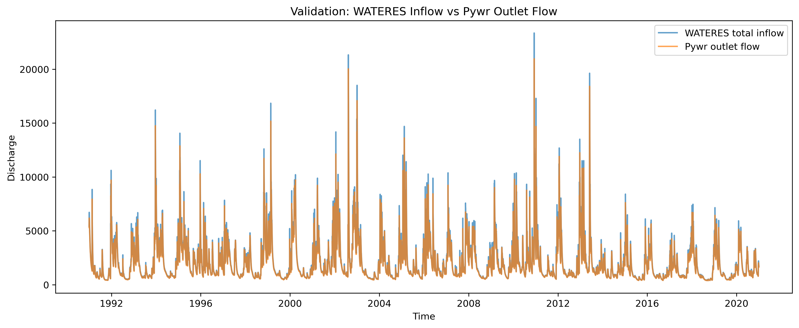

# Ohře Pywr Model

Hydrological routing model of the **Ohře River basin** implemented in
**Pywr**.

The goal of this project is to build a **water allocation model** that
represents the basin's river network, hydrological inflows, and
eventually sectoral water demands and reservoir operations.

The current implementation reproduces the **hydrological backbone** of
the basin using routed inflows from the **WATERES dataset** and a river
network reconstructed from **SWB sub-basin polygons**.

# Current Model Status

**Phase 1: Hydrological backbone (completed)**

The model currently includes:

-   reconstruction of the river network topology from SWB polygons\
-   daily routed inflows from the WATERES dataset\
-   a Pywr network representing river reaches\
-   a basin outlet for discharge aggregation\
-   validation of Pywr routing against WATERES total inflow

**Validation results:**

-   R² ≈ 0.992\
-   RMSE ≈ 167 m³/s

This confirms that the Pywr network correctly reproduces the basin
hydrology.

Future phases will add:

-   sectoral water demands\
-   reservoir operations\
-   environmental flow constraints\
-   reinforcement learning for water allocation policies

## Model Validation

The Pywr routing model was validated against the aggregated basin inflow from the WATERES dataset.

Validation metrics:

- **R² ≈ 0.992**
- **RMSE ≈ 167 m³/s**

This indicates that the Pywr network reproduces the basin hydrology with high accuracy.

### Validation Plot

# Project Structure

    ohre_pywr_model
    │
    ├── data/
    │   ├── raw/            # original datasets (WATERES, SWB shapefiles)
    │   ├── processed/      # derived datasets (river edges)
    │   └── metadata/       # variable descriptions
    │
    ├── outputs/            # generated figures and model outputs
    │
    ├── src/
    │   ├── config.py
    │   │
    │   ├── network/        # river topology reconstruction
    │   │   ├── build_connectivity.py
    │   │   └── check_missing_edges.py
    │   │
    │   ├── model/          # Pywr model construction
    │   │   └── build_pywr_network.py
    │   │
    │   ├── inflow/         # inflow processing
    │   │   └── attach_wateres_inflows.py
    │   │
    │   ├── validation/     # model verification
    │   │   └── validate_pywr_vs_wateres.py
    │   │
    │   ├── visualization/  # figure generation
    │   │   └── plot_river_network.py
    │   │
    │   └── dev/            # exploratory scripts
    │       └── inspect_wateres.py
    │
    ├── environment.yml
    └── README.md

## Modeling Pipeline

The current model reproduces the hydrological routing of the Ohře basin using the following workflow:

    SWB shapefile
            │
            ▼
    build_connectivity.py
            │
            ▼
    river_edges.csv
            │
            ▼
    build_pywr_network.py
            │
            ▼
    Pywr routing model
            │
            ▼
    validate_pywr_vs_wateres.py
            │
            ▼
    Hydrological validation

This pipeline ensures that the Pywr network correctly represents the river topology and hydrological forcing before adding water-demand components.

# Setup

Create the conda environment:

    conda env create -f environment.yml
    conda activate pywr_test

# Running the Model

Run the key scripts from the project root.

### 1. Build river network connectivity

    python -m src.network.build_connectivity

This generates:

    data/processed/river_edges.csv

### 2. Plot reconstructed river network

    python -m src.visualization.plot_river_network

Output:

    outputs/ohre_river_network.png

### 3. Validate Pywr routing against WATERES inflow

    python -m src.validation.validate_pywr_vs_wateres

This will:

-   build the Pywr river network\
-   run the model simulation\
-   compare Pywr outlet discharge with aggregated WATERES inflow

Output figure:

    outputs/validation_wateres_vs_pywr.png

# Data Sources

**WATERES dataset**

Daily routed hydrological variables for SWB sub-basins including:

-   inflow\
-   deficit\
-   yield

Period used in this model:

    1991–2020

# Model Concept

Current model structure:

    WATERES inflow
            │
            ▼
    Input nodes
            │
            ▼
    River reach nodes (SWB network)
            │
            ▼
    (optional reservoir placeholder)
            │
            ▼
    Basin outlet

This routing backbone will serve as the base for future **water
allocation modeling**.

# Author

Eleni Mickovska\
PhD research project on water resource allocation modeling
